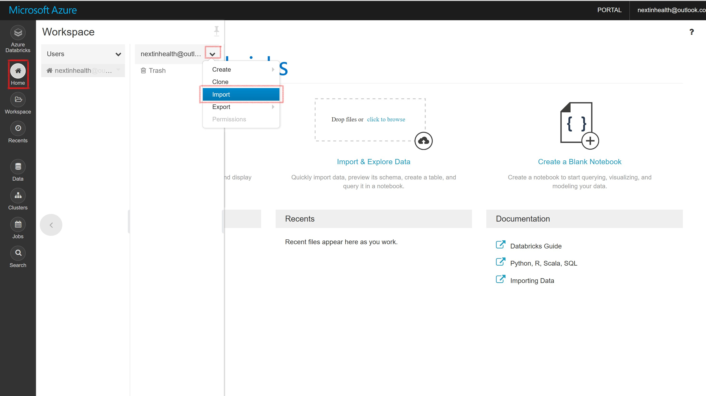
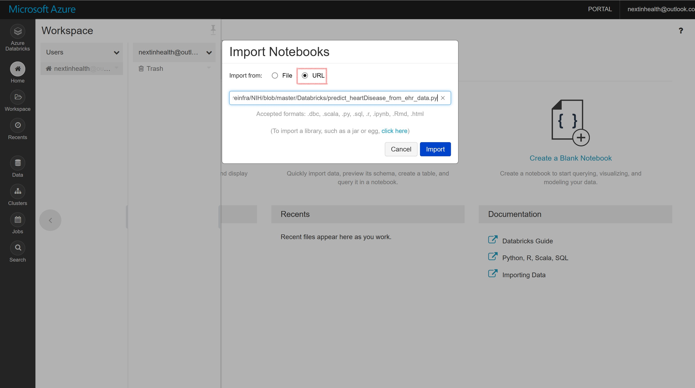

# Microsoft Next in Health - Azure for Researchers Interactive Workshop 
Toronto - April 8, 2019 

## Import a GitHub Repo to Databricks
1. In your Databricks portal, click on **Home** on the left pane and navigate to your user account. Click on the dropdown icon and select **Import**. 

  

2. Select URL and paste the notebook URL (https://github.com/azureinfra/NIH/blob/master/Databricks/predict_heartDisease_from_ehr_data.py), then click on **Import**

  
  
  
