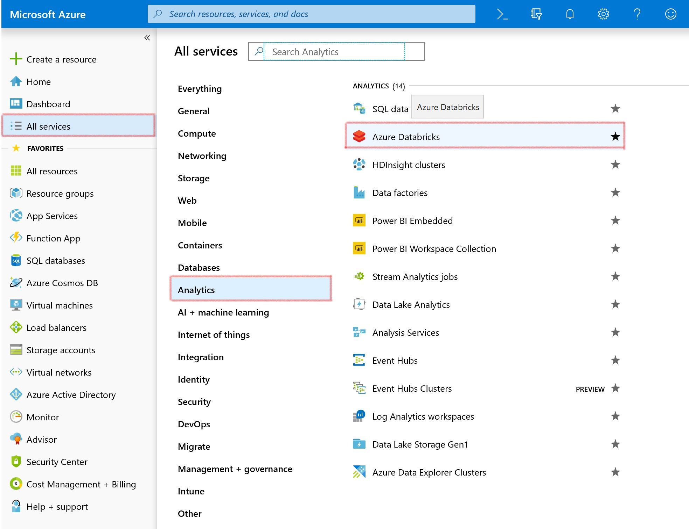
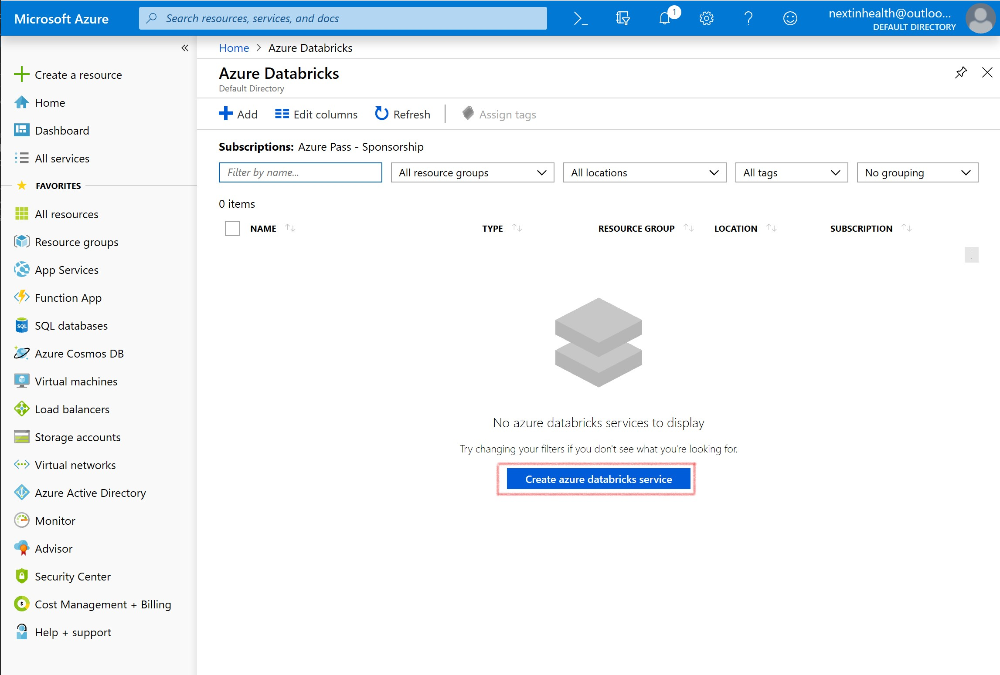
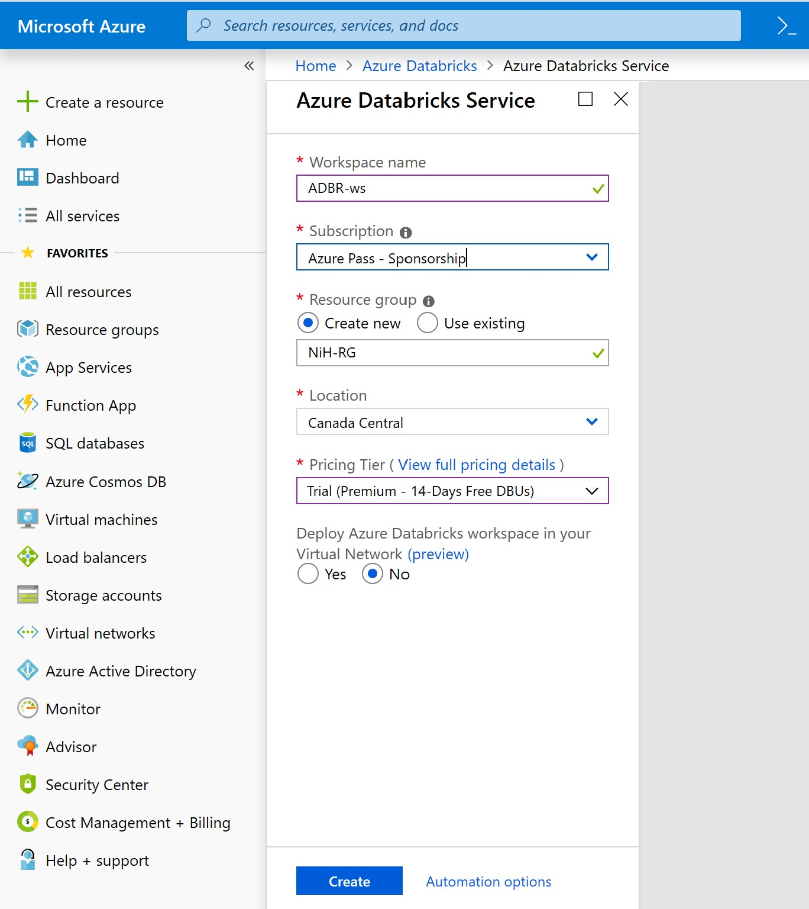
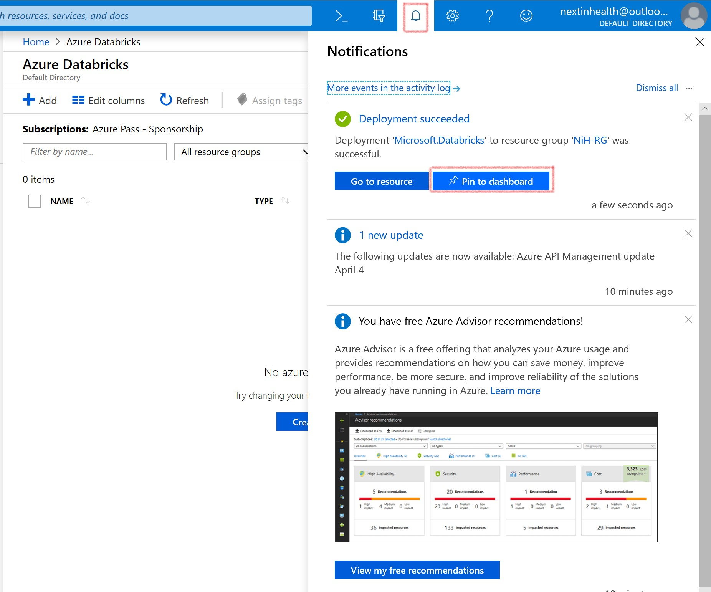

# Azure Databricks 
This quickstart shows how to create an Azure Databricks workspace and an Apache Spark cluster within that workspace. Finally, you learn how to run a Spark job on the Databricks cluster. For more information on Azure Databricks, see [What is Azure Databricks?](https://github.com/MicrosoftDocs/azure-docs/blob/master/articles/azure-databricks/what-is-azure-databricks.md)

In this quickstart, you will learn how to create and Azure Databricks workspace and create a Spark Cluster.

## Create an Azure Databricks workspace

In this section, you create an Azure Databricks workspace using the Azure portal.

1. In the Azure portal, select **All Services** > **Analytics** > **Azure Databricks**.

    

2. Under **Azure Databricks Service**, provide the values to create a Databricks workspace.

    

    Provide the following values:
    
    |Property  |Description  |
    |---------|---------|
    |**Workspace name**     | Provide a name for your Databricks workspace        |
    |**Subscription**     | From the drop-down, select your Azure subscription.        |
    |**Resource group**     | Create a new resource group. A resource group is a container that holds related resources for an Azure solution. For more information, see [Azure Resource Group overview](https://github.com/MicrosoftDocs/azure-docs/blob/master/articles/azure-resource-manager/resource-group-overview.md). |
    |**Location**     | Select **Canada Central**. For other available regions, see [Azure services available by region](https://azure.microsoft.com/regions/services/).        |
    |**Pricing Tier**     |  Choose **Trial (Premium – 14-Days Free DBUs)**. For more information on these tiers, see [Databricks pricing page](https://azure.microsoft.com/pricing/details/databricks/).       |

    

    Select **Pin to dashboard** and then click **Create**.

4. The workspace creation takes a few minutes. During workspace creation, the portal displays the **Submitting deployment for Azure Databricks** tile on the right side. You may need to scroll right on your dashboard to see the tile. There is also a progress bar displayed near the top of the screen. You can watch either area for progress. 

    

You can pin the Azure Databricks workspace after it is created as well.

    

## Create a Spark cluster in Databricks

1. Click “Go to Resource” to navigate to Azure Databricks or in the Azure portal, go to the Databricks workspace that you created, and then click **Launch Workspace**.

2. You are redirected to the Azure Databricks portal. From the portal, click **Cluster**.

    

3. In the **New cluster** page, provide the values to create a cluster.

    

    Accept all other default values other than the following:

   * Enter a name for the cluster.
   * For this workshop, create a cluster with **4.0** runtime.
   * Make sure you select the **Terminate after \_\_ minutes of inactivity** checkbox. Provide a duration (in minutes) to terminate the cluster, if the cluster is not being used.
    
     Select **Create cluster**. Once the cluster is running, you can attach notebooks to the cluster and run Spark jobs.

For more information on creating clusters, see [Create a Spark cluster in Azure Databricks](https://docs.azuredatabricks.net/user-guide/clusters/create.html).
