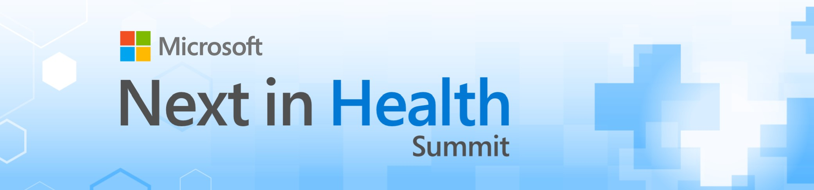
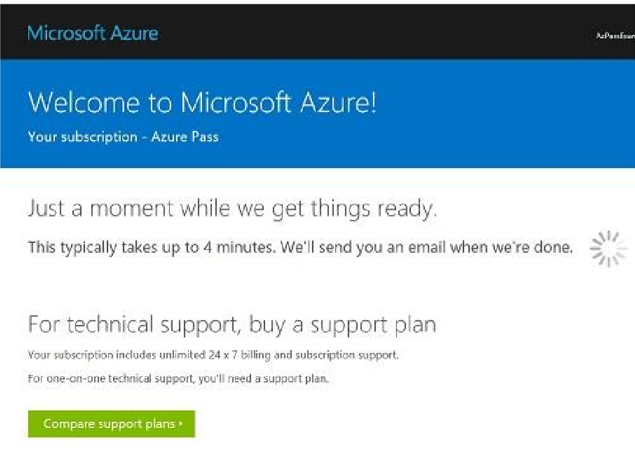

# Microsoft Next in Health - Azure for Researchers Interactive Workshop 
Toronto - April 8, 2019 

In this workshop you will learn to 
* Create your Azure subscription 
* Get familiar with Azure Portal 
* Create resources – storage and VMs
* Get familiar and run a ML algorithm with Azure Databricks

## Your Azure Pass
You will be provided with a Free to use Azure Pass account code. Please treat this as REAL MONEY as it does come out of a budget.
* Amount: **$100 USD**
* Duration: **30 days**
* Can be extended by providing a payment instrument 
 
## Requirements
* **DO NOT** redeem promo code with an email account that is attached to an Enterprise Agreement, the pass will not work. Use an email account that has **NOT** been used for Azure or O365.
* Best option is to create an Outlook.com Account to use (can be throwaway)
* Monetary credit **can't be used toward third party services**, premier support or Azure Marketplace and cannot be added to existing subscriptions. 
* Accounts cannot be extended - the duration and monetary credit amount cannot be altered
* If you remove the monetary cap by providing a payment instrument, you will be converted to a 'Pay-as-you-go' account at the end of the offer duration. However, if the account has expired, you will need to create a support ticket to enable conversion.
* The Azure Pass offers are restricted to the following regions: 
  * West US 2 
  * West Central US
  * South Central US
  * East US 
  * West Europe
  * Southeast Asia

## Creating a Microsoft Azure Pass Subscription
Creating an Azure Pass subscription is a two-step process.

### Step 1: Redeeming a Microsoft Azure Pass Promo Code:
Open a browser and navigate to: www.microsoftazurepass.com
It is recommended you close all browsers and open a new In-Private Browser session. Other log-ins can persist and cause errors during the activation step.
Click the start button to get started.

Create an email here if needed: https://signup.live.com 

Enter your account login information and select “Sign In”.

Click “Confirm” if the correct email address is listed.

Enter your promo code in the Promo code box and click “Claim Promo Code”.

It may take up to 5 minutes to process the redemption.

Click on “Activate” to start setting up your Azure subscription.

### Step 2: Activate your subscription:
Enter your account information and click “Next”.

Enter your phone number and click “Next”.

It may take a few minutes to process the request.

Your subscription is ready, click “Get started” to use Azure services.

## Get Started 
You’re all set. To can access your subscription again later navigate to Azure Portal: **http://portal.azure.com**
