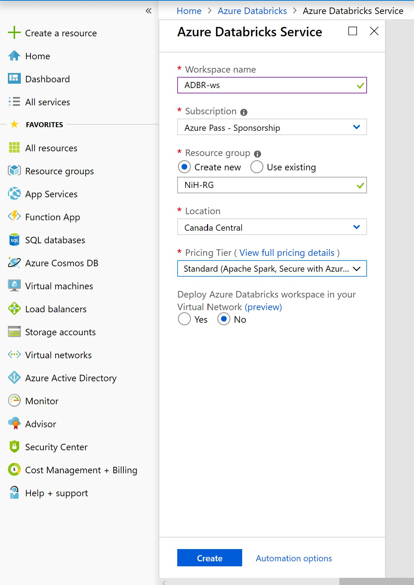
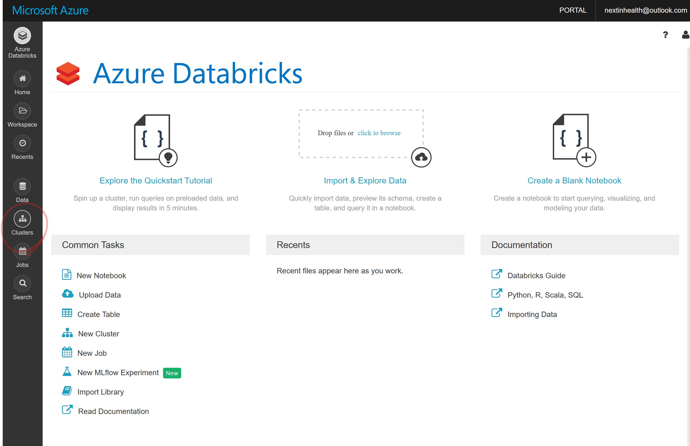

# Microsoft Next in Health - Azure for Researchers Interactive Workshop 
Toronto - April 8, 2019 

In this workshop you will learn to 
* Create your Azure subscription 
* Get familiar with Azure Portal 
* Create resources – storage and VMs
* Get familiar and run a ML algorithm with Azure Databricks

## Your Azure Pass
You will be provided with a Free to use Azure Pass account code. Please treat this as REAL MONEY as it does come out of a budget.
* Amount: **$100 USD**
* Duration: **30 days**
* Can be extended by providing a payment instrument 
 
## Requirements
* **DO NOT** redeem promo code with an email account that is attached to an Enterprise Agreement, the pass will not work. Use an email account that has **NOT** been used for Azure or O365.
* Best option is to create an Outlook.com Account to use (can be throwaway)
* Monetary credit **can't be used toward third party services**, premier support or Azure Marketplace and cannot be added to existing subscriptions. 
* Accounts cannot be extended - the duration and monetary credit amount cannot be altered
* If you remove the monetary cap by providing a payment instrument, you will be converted to a 'Pay-as-you-go' account at the end of the offer duration. However, if the account has expired, you will need to create a support ticket to enable conversion.
* The Azure Pass offers are restricted to the following regions: 
  * West US 2 
  * West Central US
  * South Central US
  * East US 
  * West Europe
  * Southeast Asia

## Creating a Microsoft Azure Pass Subscription
Creating an Azure Pass subscription is a two-step process.

### Step 1: Redeeming a Microsoft Azure Pass Promo Code:
Open a browser and navigate to: www.microsoftazurepass.com
It is recommended you close all browsers and open a new In-Private Browser session. Other log-ins can persist and cause errors during the activation step.
Click the start button to get started.

Create an email here if needed: https://signup.live.com 

Enter your account login information and select “Sign In”.

Click “Confirm” if the correct email address is listed.

Enter your promo code in the Promo code box and click “Claim Promo Code”.

It may take up to 5 minutes to process the redemption.

Click on “Activate” to start setting up your Azure subscription.

### Step 2: Activate your subscription:
Enter your account information and click “Next”.

Enter your phone number and click “Next”.

It may take a few minutes to process the request.

Your subscription is ready, click “Get started” to use Azure services.

## Get Started 
You’re all set. To can access your subscription again later navigate to Azure Portal: **http://portal.azure.com**

# Azure Data Science VM
The Microsoft Windows Data Science Virtual Machine (DSVM) is a Windows Server 2016 virtual machine (VM) image on Azure that comes preinstalled and configured with tools for data analytics and machine learning.

Included data science tools
The following tools are included in a DSVM:

Azure Machine Learning service Python SDK
Microsoft Machine Learning Server Developer edition
Anaconda Python distribution
Jupyter Notebook with R, Python, and PySpark kernels
Microsoft Visual Studio Community
Microsoft Power BI Desktop
Microsoft SQL Server 2017 Developer edition
A standalone Apache Spark instance for local development and testing
JuliaPro
Machine learning and data analytics tools:
Deep learning frameworks - a rich set of AI frameworks are included on the VM: Microsoft Cognitive Toolkit, TensorFlow, Chainer, mxNet, and Keras
Vowpal Wabbit - a fast machine learning system that supports techniques like online hashing, allreduce, reductions, learning2search, and active and interactive learning
XGBoost - a tool that provides fast and accurate boosted tree implementation
Rattle - the R analytical tool that gets you started with data analytics and machine learning in R. It includes GUI-based data exploration and modeling with automatic R code generation.
Weka - visual data mining and machine learning software in Java
Apache Drill - a schema-free SQL query engine for Apache Hadoop, NoSQL, and cloud storage. It supports ODBC and JDBC interfaces for querying NoSQL and files from standard BI tools like Power BI, Microsoft Excel, and Tableau.
Libraries in R and Python for use in Azure Machine Learning and other Azure services
Git, including Git Bash, to work with source code repositories that include GitHub and Azure DevOps. Git provides several popular Linux command-line utilities that are accessible both on Git Bash and a command prompt. Examples are awk, sed, perl, grep, find, wget, and curl.

# Azure Databricks 
This quickstart shows how to create an Azure Databricks workspace and an Apache Spark cluster within that workspace. Finally, you learn how to run a Spark job on the Databricks cluster. For more information on Azure Databricks, see [What is Azure Databricks?](https://github.com/MicrosoftDocs/azure-docs/blob/master/articles/azure-databricks/what-is-azure-databricks.md)

In this quickstart, you will learn how to create and Azure Databricks workspace and create a Spark Cluster.

## Create an Azure Databricks workspace

In this section, you create an Azure Databricks workspace using the Azure portal.

1. In the Azure portal, select **All Services** > **Analytics** > **Azure Databricks**.

    

2. Under **Azure Databricks Service**, provide the values to create a Databricks workspace.

    

    Provide the following values:
    
    |Property  |Description  |
    |---------|---------|
    |**Workspace name**     | Provide a name for your Databricks workspace        |
    |**Subscription**     | From the drop-down, select your Azure subscription.        |
    |**Resource group**     | Create a new resource group. A resource group is a container that holds related resources for an Azure solution. For more information, see [Azure Resource Group overview](https://github.com/MicrosoftDocs/azure-docs/blob/master/articles/azure-resource-manager/resource-group-overview.md). |
    |**Location**     | Select **Canada Central**. For other available regions, see [Azure services available by region](https://azure.microsoft.com/regions/services/).        |
    |**Pricing Tier**     |  Choose **Standard**. For more information on these tiers, see [Databricks pricing page](https://azure.microsoft.com/pricing/details/databricks/).       |

    

    Select **Pin to dashboard** and then click **Create**.

4. The workspace creation takes a few minutes. During workspace creation, the portal displays the **Submitting deployment for Azure Databricks** tile on the right side. You may need to scroll right on your dashboard to see the tile. There is also a progress bar displayed near the top of the screen. You can watch either area for progress. 

    

You can pin the Azure Databricks workspace after it is created as well.

    

## Create a Spark cluster in Databricks

1. Click “Go to Resource” to navigate to Azure Databricks or in the Azure portal, go to the Databricks workspace that you created, and then click **Launch Workspace**.

2. You are redirected to the Azure Databricks portal. From the portal, click **Cluster**.

    

3. In the **New cluster** page, provide the values to create a cluster.

    

    Accept all other default values other than the following:

   * Enter a name for the cluster.
   * Change min Workers to **1** and Max Workers to **2**
   * For this workshop, create a cluster with **4.0** runtime.
   * Make sure you select the **Terminate after \_\_ minutes of inactivity** checkbox. Provide a duration (in minutes) to terminate the cluster, if the cluster is not being used.
    
     Select **Create cluster**. Once the cluster is running, you can attach notebooks to the cluster and run Spark jobs.

For more information on creating clusters, see [Create a Spark cluster in Azure Databricks](https://docs.azuredatabricks.net/user-guide/clusters/create.html).

