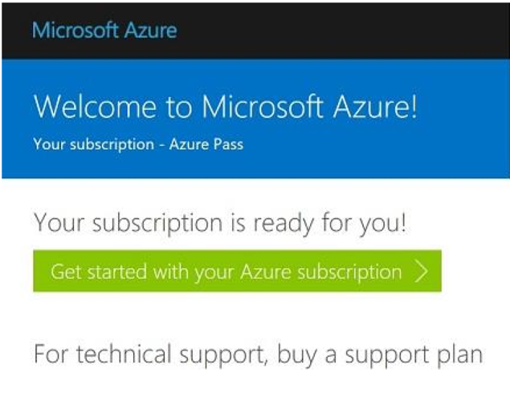
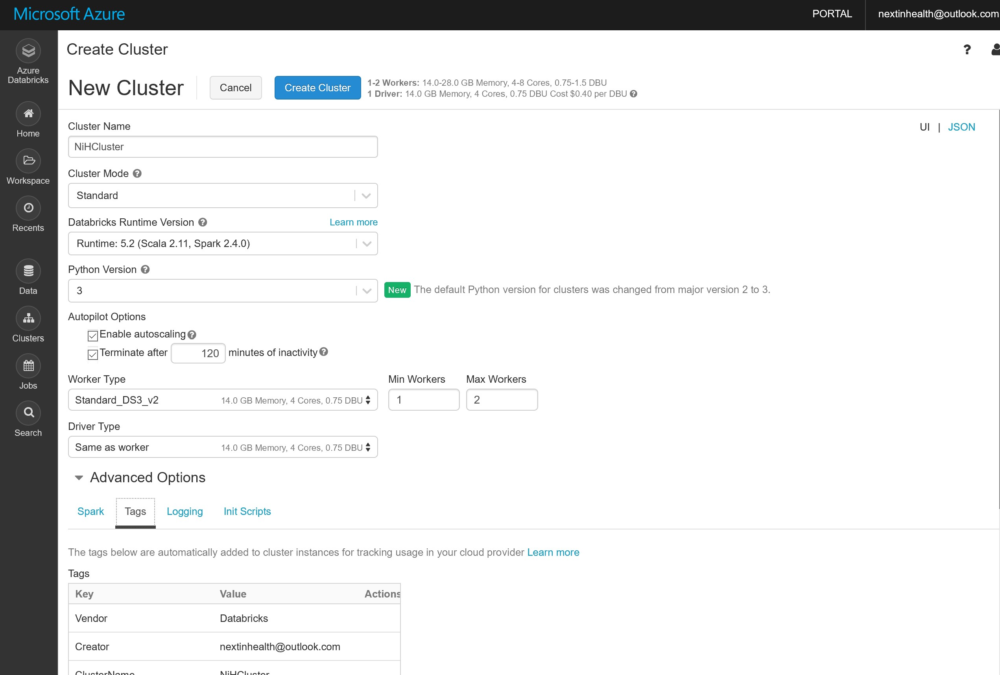

# Microsoft Next in Health - Azure for Researchers Interactive Workshop 
Toronto - April 8, 2019 

In this workshop you will learn to 
* Create your Azure subscription 
* Get familiar with Azure Portal 
* Create resources – storage and VMs
* Get familiar and run a ML algorithm with Azure Databricks

## Your Azure Pass
You will be provided with a Free to use Azure Pass account code. Please treat this as REAL MONEY as it does come out of a budget.
* Amount: **$100 USD**
* Duration: **30 days**
* Can be extended by providing a payment instrument 
 
## Requirements
* **DO NOT** redeem promo code with an email account that is attached to an Enterprise Agreement, the pass will not work. Use an email account that has **NOT** been used for Azure or O365.
* Best option is to create an Outlook.com Account to use (can be throwaway)
* Monetary credit **can't be used toward third party services**, premier support or Azure Marketplace and cannot be added to existing subscriptions. 
* Accounts cannot be extended - the duration and monetary credit amount cannot be altered
* If you remove the monetary cap by providing a payment instrument, you will be converted to a 'Pay-as-you-go' account at the end of the offer duration. However, if the account has expired, you will need to create a support ticket to enable conversion.
* The Azure Pass offers are restricted to the following regions: 
  * West US 2 
  * West Central US
  * South Central US
  * East US 
  * West Europe
  * Southeast Asia

## Creating a Microsoft Azure Pass Subscription
Creating an Azure Pass subscription is a two-step process.

### Step 1: Redeeming a Microsoft Azure Pass Promo Code:
Open a browser and navigate to: www.microsoftazurepass.com
It is recommended you close all browsers and open a new In-Private Browser session. Other log-ins can persist and cause errors during the activation step.
Click the start button to get started.

Create an email here if needed: https://signup.live.com 

Enter your account login information and select “Sign In”.

Click “Confirm” if the correct email address is listed.

Enter your promo code in the Promo code box and click “Claim Promo Code”.

It may take up to 5 minutes to process the redemption.

Click on “Activate” to start setting up your Azure subscription.

### Step 2: Activate your subscription:
Enter your account information and click “Next”.

Enter your phone number and click “Next”.

It may take a few minutes to process the request.

Your subscription is ready, click “Get started” to use Azure services.

## Get Started 
You’re all set. To can access your subscription again later navigate to Azure Portal: **http://portal.azure.com**

# Azure Data Science VM
The Microsoft Windows Data Science Virtual Machine (DSVM) is a Windows Server 2016 virtual machine (VM) image on Azure that comes preinstalled and configured with tools for data analytics and machine learning.

To create a DSVM instance:

1. Go to the virtual machine listing on the Azure portal. You may be prompted to sign in to your Azure account if you are not already signed in.

2. Select the Create button at the bottom.

3. You are required to enter the following information to configure each of the steps shown on the right pane of the screenshot:

a) Basics:
- Name: the name of the DSVM
- VM Disk Type: either SSD or HDD. For an NC_v1 GPU instance like NVidia Tesla K80 based, choose HDD as the disk type.
- User Name: the admin account ID
- Password: the admin account password
- Subscription: If you have more than one subscription, select the one on which the machine is to be created and billed.
- Resource Group. You can create a new one or use an existing group.
- Location. Select the data center that's most appropriate. For fastest network access, it's the data center that has most of your data or is closest to your physical location.

b) Size: 
Select one of the server types that meets your functional requirements and cost constraints. For more choices of VM sizes, select View All.

c) Settings:
- Use Managed Disks. Choose Managed if you want Azure to manage the disks for the VM. If not, you need to specify a new or existing storage account.
Other parameters. You can use the default values. If you want to use non-default values, hover over the informational link for help on the specific fields.

d) Summary: 
Verify that all the information you entered is correct. Select Create.

# How to access the DSVM
After the VM is created and provisioned, you can remote desktop into it by using the admin account credentials that you configured in the preceding Basics section. You're ready to start using the tools that are installed and configured on the VM. Many of the tools can be accessed through start menu tiles and desktop icons.

# Create a storage account
Now you are ready to create your storage account.

Every storage account must belong to an Azure resource group. A resource group is a logical container for grouping your Azure services. When you create a storage account, you have the option to either create a new resource group, or use an existing resource group. This quickstart shows how to create a new resource group.

A general-purpose v2 storage account provides access to all of the Azure Storage services: blobs, files, queues, tables, and disks. The quickstart creates a general-purpose v2 storage account, but the steps to create any type of storage account are similar.

To create a general-purpose v2 storage account in the Azure portal, follow these steps:

1. In the Azure portal, select All services. In the list of resources, type Storage Accounts. As you begin typing, the list filters based on your input. Select Storage Accounts.

2. On the Storage Accounts window that appears, choose Add.

3. Select the subscription in which to create the storage account.

4. Under the Resource group field, select Create new. Enter a name for your new resource group, as shown in the following image.

5. Next, enter a name for your storage account. The name you choose must be unique across Azure. The name also must be between 3 and 24 characters in length, and can include numbers and lowercase letters only.

6. Select a location for your storage account, or use the default location.

7. Leave these fields set to their default values:

Field	                            Value
Deployment model	                 Resource Manager
Performance	                      Standard
Account kind	                     StorageV2 (general-purpose v2)
Replication	                      Locally redundant storage (LRS)
Access tier	                      Hot

8. Select Review + Create to review your storage account settings and create the account.

9. Select Create.

# Azure Databricks 
This quickstart shows how to create an Azure Databricks workspace and an Apache Spark cluster within that workspace. Finally, you learn how to run a Spark job on the Databricks cluster. For more information on Azure Databricks, see [What is Azure Databricks?](https://github.com/MicrosoftDocs/azure-docs/blob/master/articles/azure-databricks/what-is-azure-databricks.md)

In this quickstart, you will learn how to create and Azure Databricks workspace and create a Spark Cluster.

## Create an Azure Databricks workspace

In this section, you create an Azure Databricks workspace using the Azure portal.

1. In the Azure portal, select **All Services** > **Analytics** > **Azure Databricks**.

    

2. Under **Azure Databricks Service**, provide the values to create a Databricks workspace.

    

    Provide the following values:
    
    |Property  |Description  |
    |---------|---------|
    |**Workspace name**     | Provide a name for your Databricks workspace        |
    |**Subscription**     | From the drop-down, select your Azure subscription.        |
    |**Resource group**     | Create a new resource group. A resource group is a container that holds related resources for an Azure solution. For more information, see [Azure Resource Group overview](https://github.com/MicrosoftDocs/azure-docs/blob/master/articles/azure-resource-manager/resource-group-overview.md). |
    |**Location**     | Select **Canada Central**. For other available regions, see [Azure services available by region](https://azure.microsoft.com/regions/services/).        |
    |**Pricing Tier**     |  Choose **Standard**. For more information on these tiers, see [Databricks pricing page](https://azure.microsoft.com/pricing/details/databricks/).       |

    

    Select **Pin to dashboard** and then click **Create**.

4. The workspace creation takes a few minutes. During workspace creation, the portal displays the **Submitting deployment for Azure Databricks** tile on the right side. You may need to scroll right on your dashboard to see the tile. There is also a progress bar displayed near the top of the screen. You can watch either area for progress. 

    

You can pin the Azure Databricks workspace after it is created as well.

    

## Create a Spark cluster in Databricks

1. Click “Go to Resource” to navigate to Azure Databricks or in the Azure portal, go to the Databricks workspace that you created, and then click **Launch Workspace**.

2. You are redirected to the Azure Databricks portal. From the portal, click **Cluster**.

    

3. In the **New cluster** page, provide the values to create a cluster.

    

    Accept all other default values other than the following:

   * Enter a name for the cluster.
   * Change min Workers to **1** and Max Workers to **2**
   * For this workshop, create a cluster with **4.0** runtime.
   * Make sure you select the **Terminate after \_\_ minutes of inactivity** checkbox. Provide a duration (in minutes) to terminate the cluster, if the cluster is not being used.
    
     Select **Create cluster**. Once the cluster is running, you can attach notebooks to the cluster and run Spark jobs.

For more information on creating clusters, see [Create a Spark cluster in Azure Databricks](https://docs.azuredatabricks.net/user-guide/clusters/create.html).

